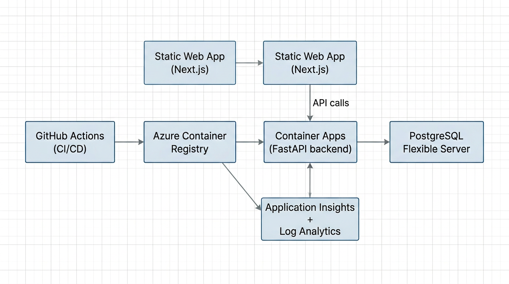
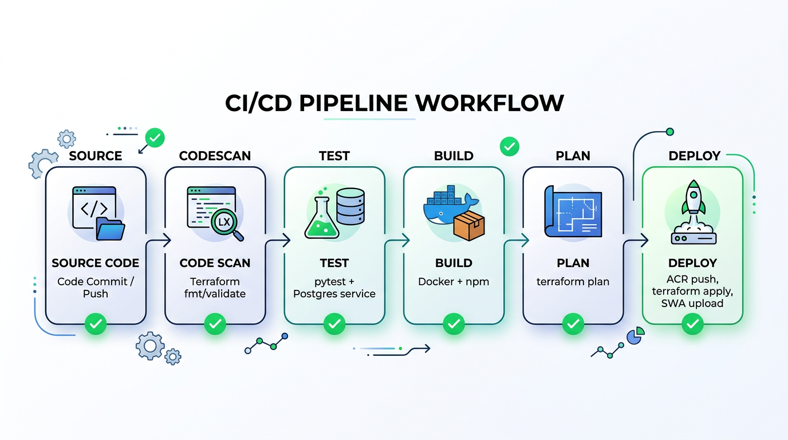
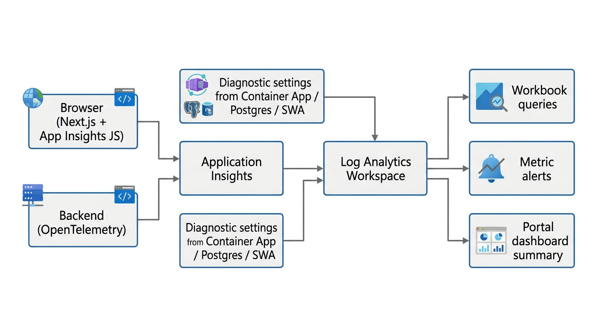
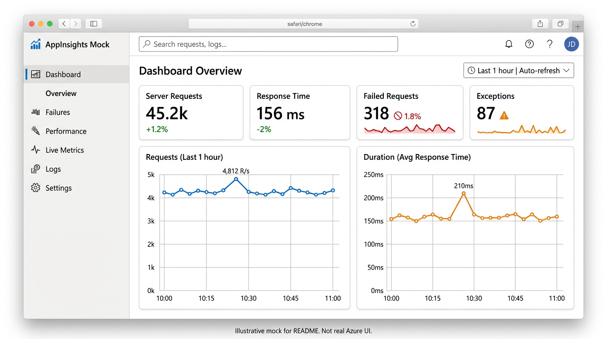
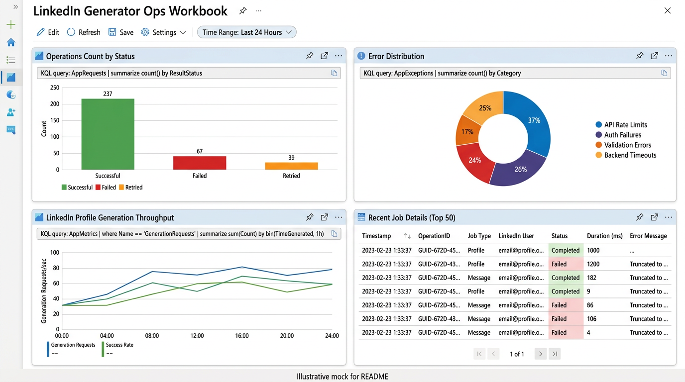

# LinkedIn Post Generator (Azure, Terraform, GitHub Actions)

End-to-end capstone project: a **Next.js** frontend and **FastAPI** backend that generate LinkedIn posts with optional **writing-style learning**, deployed to **Azure** with **Terraform** infrastructure-as-code and a single **GitHub Actions** pipeline. Observability uses **Application Insights**, **Log Analytics**, metric **alerts**, diagnostic settings, a shared **Portal dashboard**, and an **Azure Monitor workbook** with richer charts.

---

## Table of contents

- [What this repository contains](#what-this-repository-contains)
- [High-level architecture](#high-level-architecture)
- [Application behavior](#application-behavior)
- [Repository layout](#repository-layout)
- [Prerequisites](#prerequisites)
- [Local development](#local-development)
- [Configuration and secrets](#configuration-and-secrets)
- [Azure infrastructure (Terraform)](#azure-infrastructure-terraform)
- [Bootstrap (one-time automation)](#bootstrap-one-time-automation)
- [CI/CD pipeline](#cicd-pipeline)
- [Day-2 operations](#day-2-operations)
- [Observability](#observability)
- [Security hardening](#security-hardening)
- [Testing](#testing)
- [Destroy and teardown](#destroy-and-teardown)
- [Troubleshooting](#troubleshooting)
- [Visuals and screenshots](#visuals-and-screenshots)

---

## What this repository contains

| Area | Role |
|------|------|
| **Frontend** (`frontend/`) | Next.js (static export) UI: generate post, import style samples, history. Browser telemetry via Application Insights JS when configured. |
| **Backend** (`backend/`) | FastAPI API, SQLAlchemy + PostgreSQL, OpenAI integration, OpenTelemetry via Azure Monitor Distro when configured. |
| **Infrastructure** (`terraform/`) | Azure resources: RG, ACR, Container Apps, Static Web App, Postgres Flexible Server, Log Analytics, Application Insights, diagnostics, alerts, optional Front Door/WAF, portal dashboard + workbook. |
| **Automation** (`scripts/`) | `bootstrap.py` (Azure + GitHub OIDC + remote state + secrets), `destroy.py` (Terraform destroy), `deploy.py` (reminder to use GitHub Actions). |
| **CI/CD** (`.github/workflows/deploy.yml`) | Single **Pipeline** workflow: `codescan` → `test` → `build` → `plan` → `deploy` (main only). |

---

## High-level architecture

The system is split into a static site, a containerized API, a managed database, a private registry, and a telemetry plane. GitHub Actions builds and deploys after Terraform plans against remote state.



**Traffic (default configuration, `enable_front_door_waf = false`):**

1. Users open the **Azure Static Web App** URL (`frontend_url` / default hostname).
2. The browser calls the **Azure Container Apps** backend URL (`api_base_url` / ingress FQDN) for `/api/*`.
3. The backend uses **PostgreSQL Flexible Server** for persistence and **Azure OpenAI** (via API key) for generation and style analysis.

**Optional edge:** Terraform supports **Azure Front Door + WAF** behind `var.enable_front_door_waf`. It defaults to **off** because some subscription types cannot create Front Door resources. When enabled, public URLs switch to the Front Door endpoint per `locals` in `terraform/main.tf`.

---

## Application behavior

### Generate

- User provides topic, audience, tone, optional article URL, and style mode (if a profile exists).
- Backend may scrape a **public HTTP(S)** URL (SSRF-hardened) for context.
- OpenAI returns structured post data; one post is stored per generation.

### Style learning

- User pastes **at least three** prior posts (separator `---` in the UI).
- Backend builds a compact **style profile** via OpenAI and stores it in Postgres.
- Generation can run in `off`, `faithful`, or `improve` style modes when a profile exists.

### History

- Lists past generations; supports delete.

### API surface (backend)

| Method | Path | Purpose |
|--------|------|---------|
| `POST` | `/api/generate` | Generate and persist a post |
| `GET` | `/api/history` | Paginated history |
| `DELETE` | `/api/history/{id}` | Delete a generation |
| `POST` | `/api/style/import` | Build style profile from samples |
| `GET` | `/api/style/profile` | Fetch current profile |
| `GET` | `/health/live`, `/health/ready` | Liveness / readiness |

---

## Repository layout

```
linkedin_generator/
├── backend/                 # FastAPI app, Dockerfile, tests
├── frontend/                # Next.js app (static export), telemetry helper
├── terraform/               # IaC: main, alerts, observability, edge (optional), variables, outputs
├── scripts/                 # bootstrap.py, destroy.py, common.py
├── .github/workflows/
│   └── deploy.yml           # Single Pipeline workflow
├── docker-compose.yml       # Local Postgres + backend
├── .env.example             # Root env template
├── linkedin_generator.md    # Long-form design / course reference (optional reading)
└── docs/
    ├── images/              # Diagrams used by this README
    └── screenshots/         # Portal-style visuals + guide for your own captures
```

---

## Prerequisites

| Tool | Used for |
|------|-----------|
| **Azure CLI** (`az`) | Bootstrap, destroy, manual inspection |
| **Terraform** `>= 1.6` | Infra plan/apply/destroy |
| **Python** `3.11+` (local) / `3.12` (CI) | Scripts + tests |
| **Node.js 20+** | Frontend build |
| **Docker** | CI backend image build; local optional |
| **GitHub CLI** (`gh`) | Bootstrap secrets; destroy with `--include-bootstrap` |

---

## Local development

### 1. Environment files

- Copy **`.env.example`** → **`.env`** in the repo root for backend/script variables (`OPENAI_API_KEY`, optional `APPLICATIONINSIGHTS_CONNECTION_STRING`, etc.).
- For the frontend, create **`frontend/.env.local`** (see `.env.example`) with at least:

  - `NEXT_PUBLIC_API_URL=http://localhost:8000`
  - Optional: `NEXT_PUBLIC_APPLICATIONINSIGHTS_CONNECTION_STRING=` for browser telemetry during local dev.

### 2. Database + API with Docker Compose

```bash
# from repo root — requires OPENAI_API_KEY in your shell or .env for compose variable substitution
docker compose up --build
```

Backend listens on **http://localhost:8000**. Postgres is defined in `docker-compose.yml`.

### 3. Frontend dev server

```bash
cd frontend
npm install
npm run dev
```

Open **http://localhost:3000**.

### 4. Tests (backend)

```bash
pip install -r backend/requirements.txt
set PYTHONPATH=backend
python -m pytest backend/tests -v
```

On Windows, if Postgres is not on `localhost:5432`, start a test database or use Docker as in CI.

---

## Configuration and secrets

### Root `.env` (local convenience)

Used by `scripts/bootstrap.py` and friends. Typical keys:

| Variable | Purpose |
|----------|---------|
| `OPENAI_API_KEY` | OpenAI API access |
| `ALERT_EMAIL` | Optional; forwarded into bootstrap for GitHub secret |
| `APPLICATIONINSIGHTS_CONNECTION_STRING` | Optional local backend telemetry |

### GitHub Actions secrets (production)

Created by **`python scripts/bootstrap.py`**. Include (names align with workflow):

- `AZURE_CLIENT_ID`, `AZURE_TENANT_ID`, `AZURE_SUBSCRIPTION_ID`
- `AZURE_RESOURCE_GROUP`
- `TF_BACKEND_RESOURCE_GROUP`, `TF_BACKEND_STORAGE_ACCOUNT`, `TF_BACKEND_CONTAINER`, `TF_BACKEND_KEY`
- `OPENAI_API_KEY`, `DB_PASSWORD`
- `ALERT_EMAIL` — if **empty**, Terraform **does not** create email action groups or metric alerts (see `terraform/alerts.tf` `count`).

### Frontend build-time variables (production)

The deploy job sets:

- `NEXT_PUBLIC_API_URL` → Terraform output `api_base_url` (backend the browser should call).
- `NEXT_PUBLIC_APPLICATIONINSIGHTS_CONNECTION_STRING` → Terraform output `app_insights_connection_string` (marked **sensitive** in Terraform; workflow still reads it with `terraform output -raw` for the static build).

Because the frontend is **`output: "export"`**, these must exist **at `npm run build` time**, not only at runtime.

---

## Azure infrastructure (Terraform)

### Resource group and naming

- Default RG: `rg-linkedin-gen-prod` (from `project` + `environment` locals).
- Resources are tagged with `project`, `environment`, `managed_by = terraform`.

### Core resources (always deployed when applied)

| Resource | Purpose |
|----------|---------|
| **Azure Container Registry** | Stores backend images; workflow pushes `backend:<git-sha>` |
| **Container Apps Environment + Container App** | Runs FastAPI; HTTP ingress; scaling rules; secrets for DB and OpenAI |
| **Azure Database for PostgreSQL Flexible Server** | Primary datastore (`postgres_location` defaults away from restricted regions if needed) |
| **Azure Static Web Apps** | Hosts exported Next.js site |
| **Log Analytics Workspace** | Central logs/metrics ingestion for queries |
| **Application Insights** (workspace-based) | APM, custom metrics, browser events |
| **Diagnostic settings** | Export platform metrics/logs from Container App, SWA, Postgres to the workspace |
| **Metric alerts + action group** | Only when `alert_email` is non-empty |
| **Portal dashboard** | Lightweight Markdown summary (`dash-<prefix>`) |
| **Application Insights workbook** | Richer KQL-based charts (`LinkedIn Generator Ops Workbook`) |

### Optional: Front Door + WAF

- Controlled by **`enable_front_door_waf`** (default `false` in `terraform/variables.tf`).
- When `true`, `terraform/edge.tf` provisions Front Door, routing, and WAF policy; public URL locals prefer the Front Door hostname.

### Important Terraform outputs

| Output | Meaning |
|--------|---------|
| `frontend_url` | Public site URL (SWA or Front Door) |
| `api_base_url` | Public API base URL the browser uses |
| `backend_url` | Direct Container App HTTPS URL |
| `static_web_app_direct_url` | SWA hostname URL |
| `operations_dashboard_name` | Portal dashboard resource name |
| `operations_workbook_name` / `operations_workbook_id` | Ops workbook |
| `app_insights_connection_string` | Sensitive; used in CI for frontend build |

---

## Bootstrap (one-time automation)

From the repo root (Azure CLI logged in; GitHub CLI logged in unless `--skip-github-secrets`):

```bash
python scripts/bootstrap.py
```

This typically:

1. Ensures **remote Terraform state** storage (resource group + storage account + container).
2. Creates an **Azure AD application + federated credential** for GitHub OIDC.
3. Grants required roles (including state blob access for the GitHub identity).
4. Writes **`.deploy.auto.json`** with automation metadata.
5. Sets **GitHub repository secrets** used by the Pipeline.

See `scripts/bootstrap.py` for flags (`--location`, `--tfstate-storage-account`, `--alert-email`, etc.).

---

## CI/CD pipeline

Single workflow: **`.github/workflows/deploy.yml`** (`name: Pipeline`).



### Stages

| Job | What it does |
|-----|----------------|
| **codescan** | `python -m compileall backend scripts`; `terraform fmt -check`, `init -backend=false`, `validate` |
| **test** | Service container **Postgres 16**; `pip install`; `pytest backend/tests` |
| **build** | `docker build ./backend`; `npm ci` + `npm run build` for frontend (placeholder public envs for compile) |
| **plan** | Azure OIDC login; `terraform init` with remote backend; `terraform plan` with secrets |
| **deploy** | Only on **`push` to `main`** (not PRs): login, optional targeted apply for RG+ACR, **docker build+push** to ACR, **full `terraform apply`**, capture outputs, **smoke test** backend, build frontend with **real** `NEXT_PUBLIC_*`, **upload** `frontend/out` to Static Web Apps, **tighten CORS** to deployed `FRONTEND_URL`, final smoke tests |

**Auth model:** GitHub Actions uses **Workload Identity Federation** (`ARM_USE_OIDC`, `azure/login`), not long-lived Azure passwords in the workflow file.

---

## Day-2 operations

### Deploy a code change

1. Commit and **push to `main`**.
2. Watch **GitHub → Actions → Pipeline**.
3. After success, confirm:
   - `curl` or browser open `frontend_url` from Terraform output or the workflow log.
   - Backend `/health/ready` returns OK.

`python scripts/deploy.py` intentionally does **not** deploy; it points you at GitHub Actions.

### Find URLs quickly

```bash
cd terraform
terraform output frontend_url
terraform output api_base_url
terraform output backend_url
```

---

## Observability



### Backend

- If `APPLICATIONINSIGHTS_CONNECTION_STRING` is set on the Container App (Terraform sets it from Application Insights), `backend/app/main.py` calls `configure_azure_monitor(...)`.
- Custom **OpenTelemetry metrics and spans** live in `backend/app/telemetry.py` and are invoked from routes and services (generation, style import, OpenAI calls, scraping).

Examples of **custom metric names** (in Application Insights / `AppMetrics`):

- `linkedin_generator.generation.requests`, `...generation.failures`, `...generation.duration_ms`
- `linkedin_generator.style_import.*`
- `linkedin_generator.openai.*`
- `linkedin_generator.scrape.*`

Dimensions include **tone**, **style_mode**, **source_type** (`url` vs `manual`), etc., so workbook panels can break down usage meaningfully.

### Frontend (browser)

- `frontend/lib/telemetry.ts` loads **Application Insights Web SDK** when `NEXT_PUBLIC_APPLICATIONINSIGHTS_CONNECTION_STRING` is non-empty.
- `frontend/pages/_app.tsx` tracks route changes as page views.
- Key user actions emit **custom events** (for example `frontend_generate_submitted`) visible under **`AppEvents`** in Log Analytics.

### Azure Monitor workbook

Terraform creates **`LinkedIn Generator Ops Workbook`** (`azurerm_application_insights_workbook`). In the portal, workbooks created via API often appear with a **GUID resource name**; find it under the resource group or global search by display name.

The workbook JSON includes KQL over **`AppRequests`**, **`AppMetrics`**, **`AppEvents`**, and **`AzureMetrics`** for richer charts (bars, pies, time series, failure tables) than the legacy portal dashboard resource allows Terraform to manage reliably.

### Portal dashboard

`azurerm_portal_dashboard` provides **`dash-<prefix>`** as a **summary** page (links and text). Chart-heavy views are intentionally delegated to the workbook.

### Alerts

When `ALERT_EMAIL` GitHub secret is set, Terraform provisions an email action group and metric alerts (failed requests, latency). If `ALERT_EMAIL` is blank, those resources are **not** created.

### Diagnostic settings

Platform metrics/logs from Container App, Static Web App, and Postgres are sent to the Log Analytics workspace for cross-resource queries.

---

## Security hardening

| Layer | Implementation |
|-------|------------------|
| **CORS** | Starts permissive during apply for pipeline health; deploy job sets `allowed_origins` to the deployed Static Web App URL. |
| **Trusted hosts** | `TrustedHostMiddleware` with configurable `TRUSTED_HOSTS` (`backend/app/config.py`). |
| **URL scraping** | Only public HTTP(S); blocks private IPs / localhost patterns (`backend/app/services/scraper.py`). |
| **Static Web App headers** | `frontend/public/staticwebapp.config.json` sets security headers for the exported site. |
| **Secrets** | OpenAI key and DB password live in Container App secrets / GitHub secrets, not in source. |
| **WAF** | Optional via Front Door (`terraform/edge.tf`) when subscription supports it. |

---

## Testing

| Scope | Command |
|-------|---------|
| Backend unit/API tests | `python -m pytest backend/tests -v` with `PYTHONPATH=backend` and a reachable Postgres test DB |
| Frontend typecheck + production build | `cd frontend && npm ci && npm run build` |
| Terraform | `terraform fmt -check` and `terraform validate` (CI runs these in `codescan`) |

---

## Destroy and teardown

### Application only (keep bootstrap for redeploy)

```bash
python scripts/destroy.py
```

Runs `terraform destroy -auto-approve` with the same variable wiring as apply. You still need `.deploy.auto.json` and a DB password source (see `scripts/destroy.py`).

### Full teardown including GitHub OIDC + state storage

```bash
python scripts/destroy.py --include-bootstrap
```

Requires `gh` auth; deletes GitHub secrets, Azure AD app, and starts deletion of the Terraform state resource group.

You do **not** need to run `terraform destroy` manually for the app path; the script does it.

---

## Troubleshooting

| Symptom | Things to check |
|---------|-------------------|
| **Pipeline `plan` fails on outputs** | Sensitive outputs must stay `sensitive = true` where Terraform requires it (e.g. `app_insights_connection_string`). |
| **Empty charts** | Generate traffic on the site, wait a few minutes for ingestion, then refresh workbook / App Insights. |
| **Browser telemetry missing** | Confirm production build received `NEXT_PUBLIC_APPLICATIONINSIGHTS_CONNECTION_STRING` (deploy log env) and that the browser is not blocking scripts. |
| **CORS errors** | Ensure final apply ran with `allowed_origins` matching the Static Web App URL; hard-refresh the site. |
| **Postgres region blocked** | `terraform/variables.tf` `postgres_location` may differ from `location`. |

---

## Visuals and screenshots

### Architecture and pipeline (diagrams)

These are **checked into** `docs/images/` for stable README rendering on GitHub:

| File | Description |
|------|-------------|
| [architecture-overview.png](./docs/images/architecture-overview.png) | Components and data flow between GitHub, Azure services, and telemetry. |
| [cicd-pipeline.png](./docs/images/cicd-pipeline.png) | Pipeline stage overview. |
| [observability-data-flow.png](./docs/images/observability-data-flow.png) | Telemetry from browser + backend into App Insights / Log Analytics and workbooks. |

### Portal-style visuals (illustrative mocks)

The following files are **stylized documentation mocks**, not exports from your Azure subscription. Replace them with your own captures if you want authentic screenshots (see [docs/screenshots/README.md](./docs/screenshots/README.md)).

| Preview | File |
|---------|------|
| Illustrative Application Insights style view |  |
| Illustrative workbook layout |  |

### Adding your real Azure screenshots

Follow **[docs/screenshots/README.md](./docs/screenshots/README.md)** for a checklist of recommended captures and filenames. After you add images, link them from this section the same way as the mocks above.

---

## License and course use

This project is intended as a **student capstone** reference: study the Terraform and workflow wiring before running destroy in a shared subscription, and rotate any keys that ever appeared in local logs.
